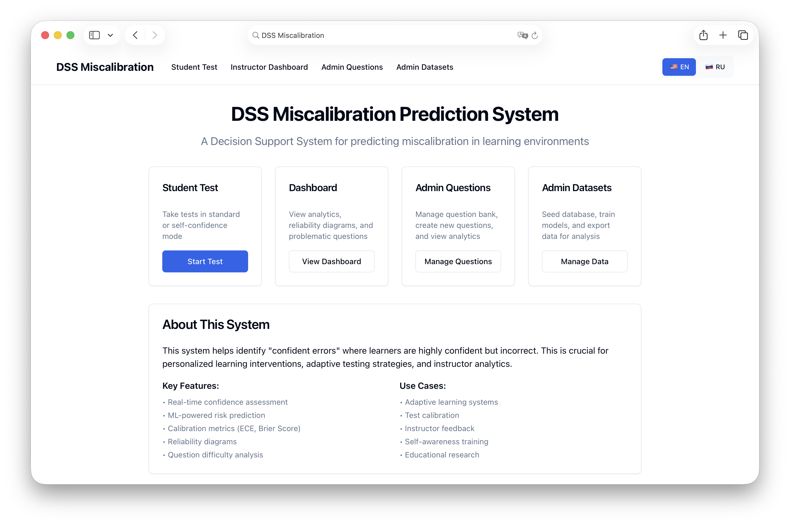
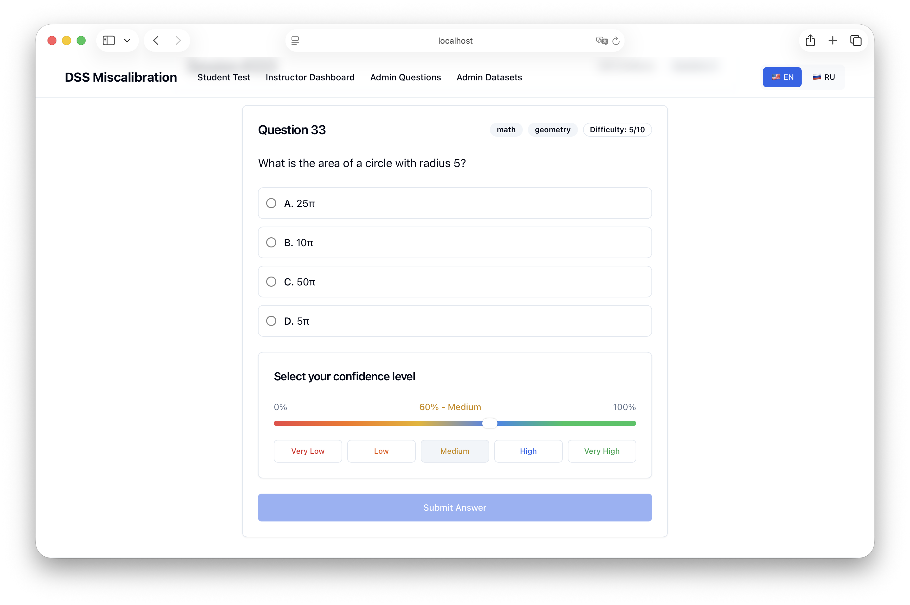
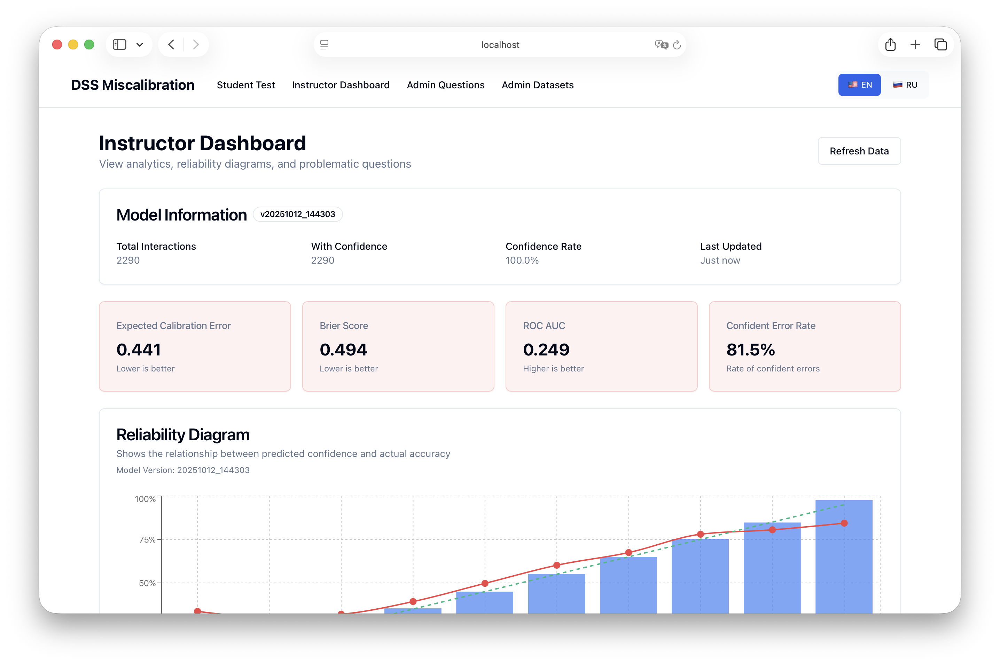
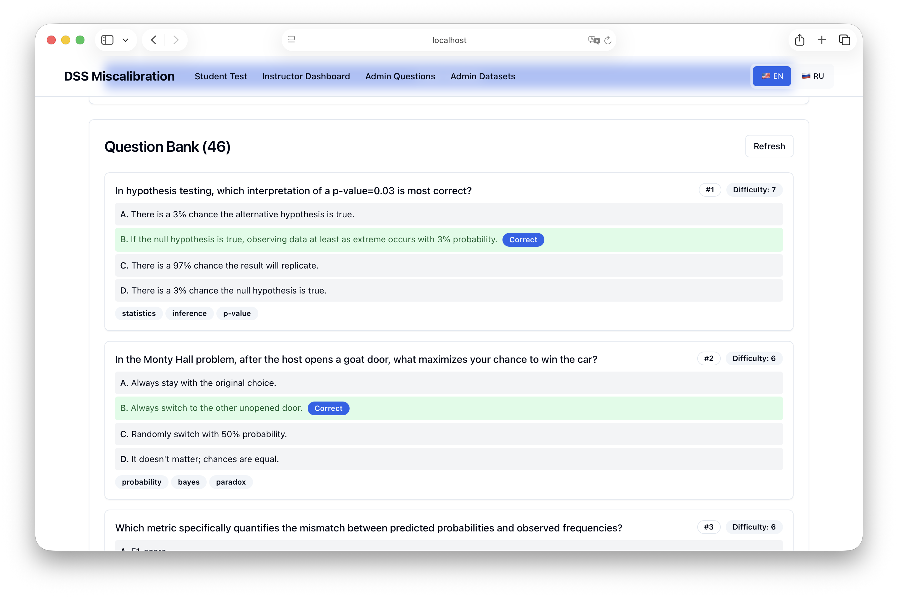
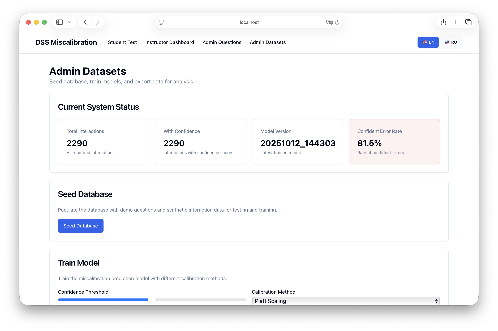

# DSS Miscalibration Prediction System

A Decision Support System (DSS) for predicting miscalibration - the mismatch between subjective confidence and actual accuracy in learning environments.

## Overview

This system helps identify "confident errors" where learners are highly confident but incorrect, which is crucial for:
- Personalized learning interventions
- Adaptive testing strategies  
- Instructor analytics and feedback
- Self-awareness training

## Screenshots

### Home Page


### Student Interface


### Instructor Dashboard


### Questions Controls


### Admin Datasets


And more...

## Features

### Student Interface
- **Standard Mode**: Regular test-taking with optional confidence reporting
- **Self-Confidence Mode**: Mandatory confidence assessment for calibration data collection
- Real-time risk warnings for potential confident errors

### Instructor Dashboard
- Calibration metrics (ECE, Brier Score, ROC-AUC)
- Reliability diagrams and confidence-accuracy analysis
- Problematic question identification
- Performance analytics by tags/categories

### Admin Controls
- Question bank management
- Dataset seeding with synthetic interactions
- Model training with different calibration methods
- Export capabilities for offline analysis

## Architecture

```
┌─────────────┐    ┌─────────────┐    ┌─────────────┐
│   Frontend  │◄──►│   Backend   │◄──►│   SQLite    │
│  (Next.js)  │    │  (FastAPI)  │    │  Database   │
└─────────────┘    └─────────────┘    └─────────────┘
                           │
                           ▼
                   ┌─────────────┐
                   │ ML Pipeline │
                   │  (sk-learn) │
                   └─────────────┘
```

### Data Flow
1. **Sessions** → **Interactions** → **Aggregates** (user/item stats)
2. **Training Pipeline**: Interactions → Features → Model → Registry
3. **Inference**: New interactions → Risk prediction → Recommendations

## Database Schema

### Core Tables
- `users(id, role)` - Roles: student|instructor|admin
- `items(id, stem, options_json, correct_option, tags, difficulty_hint, created_at)`
- `sessions(id, user_id, mode, created_at, finished_at)` - Modes: standard|self_confidence
- `interactions(id, session_id, user_id, item_id, chosen_option, is_correct, confidence, response_time_ms, attempts_count, timestamp)`

### Aggregated Tables
- `aggregates_items(item_id, avg_accuracy, avg_confidence, avg_conf_gap, avg_time_ms, elo_difficulty)`
- `aggregates_users(user_id, ema_accuracy, ema_confidence, ema_conf_gap, avg_time_ms, elo_ability)`
- `model_registry(id, version, trained_at, params_json, calib_type, ece, brier, roc_auc, notes)`

## Dataset Generation

The system generates synthetic data directly in the database:
- 40+ diverse questions across math, logic, CS, reading, general knowledge
- Realistic interaction patterns with varying confidence levels
- Difficulty-based response time modeling
- Tag-based question categorization

## API Reference

### Questions
- `POST /api/v1/questions` - Create question (admin)
- `GET /api/v1/questions/next?session_id=` - Get next question
- `GET /api/v1/questions/{id}` - Get question details

### Sessions
- `POST /api/v1/sessions` - Create session
- `POST /api/v1/sessions/{id}/answer` - Submit answer

### Prediction
- `POST /api/v1/predict` - Predict confident error risk

### Analytics
- `GET /api/v1/analytics/overview` - System metrics
- `GET /api/v1/analytics/reliability` - Reliability diagram data
- `GET /api/v1/items/problematic` - Problematic questions

### Admin
- `POST /api/v1/ingest/seed` - Seed database
- `POST /api/v1/train` - Train model
- `GET /api/v1/export/interactions` - Export data

## Model & Metrics

### Baseline Model
- **Algorithm**: Logistic Regression
- **Target**: Confident Error = (is_correct=0 & confidence≥threshold)
- **Features**: User/item aggregates, response patterns, temporal context

### Calibration Methods
- **Platt Scaling**: Sigmoid transformation
- **Isotonic Regression**: Non-parametric calibration
- **None**: Raw model probabilities

### Evaluation Metrics
- **ECE (Expected Calibration Error)**: Binned confidence-accuracy difference
- **MCE (Maximum Calibration Error)**: Maximum bin error
- **Brier Score**: Probability scoring rule
- **ROC-AUC**: Discrimination ability

## Quick Start

### Prerequisites
- Docker & Docker Compose
- Make (optional, for convenience commands)

### Setup
```bash
# Clone and setup
git clone <repository>
cd dss-miscalibration

# Start services
make dev

# Seed database with demo data
make seed

# Train initial model
make train

# Open frontend
make open
```

### Manual Setup
```bash
# Start services
docker-compose up -d

# Seed database
curl -X POST http://localhost:8000/api/v1/ingest/seed \
  -H "X-API-Key: dev-key"

# Train model
curl -X POST http://localhost:8000/api/v1/train \
  -H "X-API-Key: dev-key" \
  -H "Content-Type: application/json" \
  -d '{"confidence_threshold": 0.7, "calibration": "platt", "bins": 10}'
```

## Configuration

Environment variables (`.env`):
```bash
BACKEND_PORT=8000
FRONTEND_PORT=3000
API_KEY=dev-key
CONF_THRESHOLD=0.7
ALLOWED_ORIGINS=*
NEXT_PUBLIC_API_BASE=http://localhost:8000
```

## Performance Targets

- Prediction latency: <150ms for batches up to 100 records
- Real-time UI updates with validated confidence input (0-100%)
- Automatic aggregate updates after each interaction
- Lightweight Elo-based ability/difficulty estimation

## Limitations & Future Work

### Current Limitations
- Single global model (no personalization)
- Basic IRT implementation (simplified Elo)
- Limited question types (single-choice only)
- No user authentication system

### Next Steps
- Personalized models per user/skill
- Advanced IRT with item response functions
- Multi-choice and open-ended questions
- OAuth integration and user management
- Real-time collaborative features
- Advanced visualization and reporting

## License

MIT License - see LICENSE file for details.

## Contributing

This is an educational project. Contributions welcome for:
- Additional question banks
- Improved ML models
- Enhanced visualizations
- Performance optimizations
